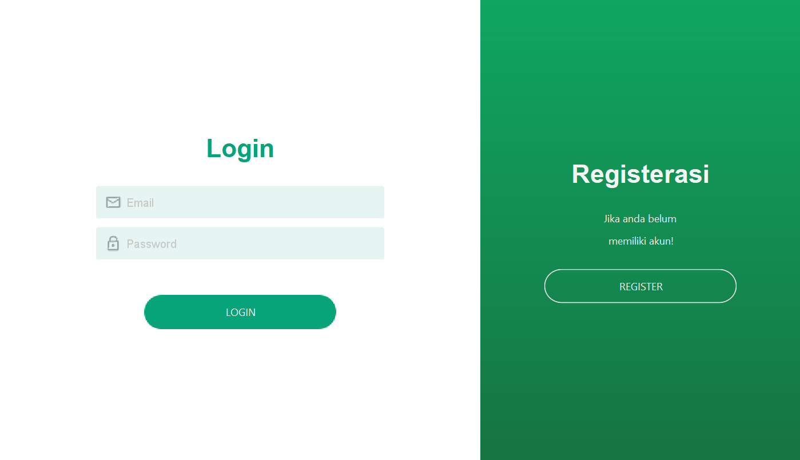
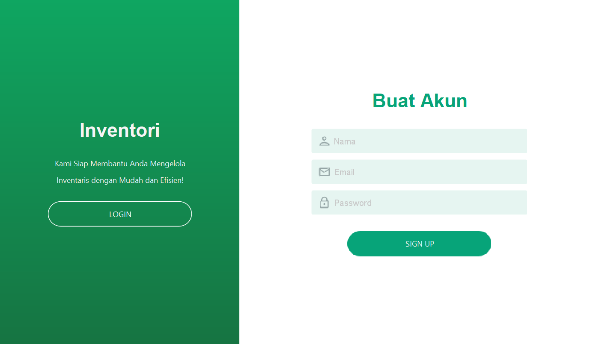

<p align="center">
  
  
  
  
  
</p>

---

# 🌟 **INVENTORYKU** 🌟  
Solusi Manajemen Inventaris Modern untuk Bisnis Anda  

  

---

## 📚 **Navigasi**  
- [✨ Fitur Unggulan](#-fitur-unggulan)  
- [🛠️ Teknologi yang Digunakan](#️-teknologi-yang-digunakan)  
- [🖥️ Pratinjau Aplikasi](#️-pratinjau-aplikasi)  
- [⚙️ Cara Instalasi](#-cara-instalasi)  
- [📋 Struktur Database](#-struktur-database)  
- [💡 Kenapa Memilih INVENTORYKU?](#-kenapa-memilih-inventoryku)  
- [🤝 Kontribusi](#-kontribusi)  
- [📞 Kontak](#-kontak)  

---

## ✨ **Fitur Unggulan**  
### 🚀 **Dashboard Interaktif**  
- 📊 Statistik barang masuk, keluar, dan total barang dalam satu tampilan.  
- 🔍 Data real-time dalam bentuk grafik dan angka untuk memudahkan analisis.

### 🛒 **Manajemen Data Barang**  
- ➕ Tambah, 🗑️ hapus, dan ✏️ perbarui barang dengan mudah.  
- 🔎 Filter dan cari barang berdasarkan kategori, nama, atau kode barang.  

### 📦 **Barang Masuk & Keluar**  
- ✅ Pantau pergerakan barang masuk dan keluar untuk memastikan stok selalu terkontrol.  

### 📜 **Riwayat Transaksi**  
- 🗂️ Catatan transaksi tersimpan untuk audit yang cepat dan akurat.

### 🔍 **Pencarian dan Filter Canggih**  
- 🔧 Fitur pencarian canggih untuk menemukan barang secara instan.  

---

## 🛠️ **Teknologi yang Digunakan**  
- **💻 Bahasa Pemrograman:**   
- **🎨 GUI Framework:**     
- **🗄️ Database:**   
- **🛠️ IDE:**   

---

## 🖥️ **Pratinjau Aplikasi**  

### **Halaman Login**  
  

### **Halaman Register**  
  

### **Halaman Utama**  
  

---

## ⚙ **Cara Instalasi**  
### Langkah 1: Clone Repository  
```bash  
git clone https://github.com/iqbalhikam/INVENTORYKU.git  
```  

### Langkah 2: Impor ke IDE  
- Buka **NetBeans** atau IDE pilihan Anda.  
- Impor proyek dari folder yang sudah di-clone.  

### Langkah 3: Konfigurasi Database  
- Pastikan MySQL berjalan di sistem Anda.  
- Edit file konfigurasi database agar sesuai dengan detail berikut:  
  - **Username:** root  
  - **Password:** *(kosong)*  

### Langkah 4: Jalankan Aplikasi  
- Jalankan aplikasi langsung dari IDE.  

---

## 📋 **Struktur Database**  
Struktur tabel dan data contoh tersedia dalam file `database.sql` di root directory.  

---

## 💡 **Kenapa Memilih INVENTORYKU?**  
- ⏱️ **Efisiensi Waktu:** Dengan antarmuka sederhana, semua data inventaris dapat diakses dengan cepat.  
- ✅ **Akurasi Data:** Minimalkan kesalahan manual dengan pencatatan yang terstruktur.  
- 📈 **Skalabilitas:** Dapat digunakan oleh bisnis kecil hingga besar.  

---

## 🤝 **Kontribusi**  
Kami selalu terbuka untuk kontribusi!  
1. Fork repository ini.  
2. Buat branch baru untuk fitur atau perbaikan Anda.  
3. Kirim pull request untuk ditinjau.  

---

## 📞 **Kontak**  
Jika Anda memiliki pertanyaan atau masalah terkait aplikasi, silakan hubungi kami di:  
📧 **Email:** idiscrus@gemail.com  

---

