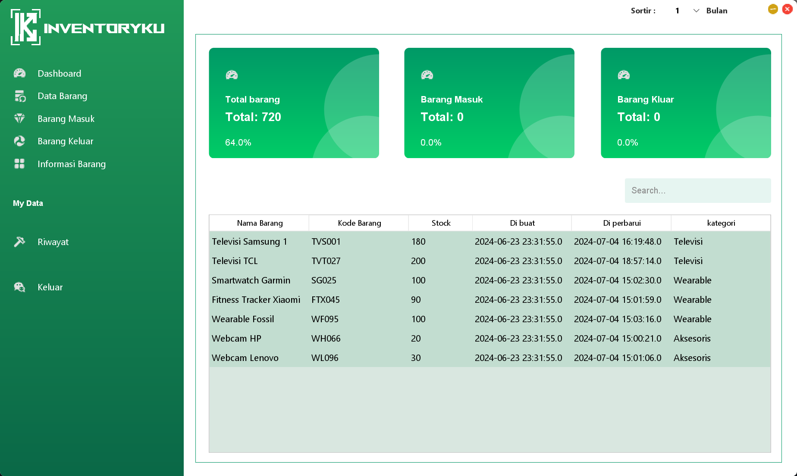

---

# 🌟 **INVENTORYKU** 🌟  
Solusi Manajemen Inventaris Modern untuk Bisnis Anda  



**INVENTORYKU** adalah aplikasi inventaris yang dirancang untuk membantu bisnis Anda mengelola stok barang, barang masuk, barang keluar, dan informasi barang dengan mudah. Dengan antarmuka yang user-friendly dan fitur yang kaya, aplikasi ini memberikan efisiensi dalam pengelolaan data inventaris.

---

## ✨ **Fitur Unggulan**  
### 🚀 **Dashboard Interaktif**  
- Lihat statistik barang masuk, keluar, dan total barang dalam satu tampilan.  
- Data ditampilkan dalam bentuk grafik dan angka real-time untuk memudahkan analisis.

### 🛒 **Manajemen Data Barang**  
- Tambah, hapus, atau perbarui barang dengan mudah.  
- Filter dan cari barang berdasarkan kategori, nama, atau kode barang.  

### 📦 **Barang Masuk & Keluar**  
- Pantau pergerakan barang masuk dan keluar untuk memastikan stok selalu terkontrol.  

### 📜 **Riwayat Transaksi**  
- Riwayat aktivitas barang tersimpan, memungkinkan audit yang akurat dan cepat.

### 🔍 **Pencarian dan Filter Canggih**  
- Fitur pencarian yang memudahkan pengguna menemukan barang secara cepat berdasarkan atribut tertentu.  

---

## 🛠️ **Teknologi yang Digunakan**  
- **Bahasa Pemrograman:** Java  
- **Framework GUI:** Swing/JavaFX  
- **Database:** MySQL  
- **IDE:** NetBeans  

---

## 🖥️ **Pratinjau Aplikasi**  
  

---

## ⚙️ **Cara Instalasi**  
### Langkah 1: Clone Repository  
```bash  
git clone https://github.com/iqbalhikam/INVENTORYKU.git  
```  

### Langkah 2: Impor ke IDE  
- Buka **NetBeans** atau IDE pilihan Anda.  
- Impor proyek dari folder yang sudah di-clone.  

### Langkah 3: Konfigurasi Database  
- Pastikan MySQL berjalan di sistem Anda.  
- Edit file konfigurasi database agar sesuai dengan detail berikut:  
  - **Username:** root  
  - **Password:** *(kosong)*  

### Langkah 4: Jalankan Aplikasi  
- Jalankan aplikasi langsung dari IDE atau gunakan file `.jar` yang tersedia di repository.  

---

## 📋 **Struktur Database**  
Struktur tabel dan data awal tersedia dalam file `database.sql` di root directory.  

---

## 💡 **Kenapa Memilih INVENTORYKU?**  
- **Efisiensi Waktu:** Dengan antarmuka sederhana, semua data inventaris dapat diakses dengan cepat.  
- **Akurasi Data:** Minimalkan kesalahan manual dengan pencatatan yang terstruktur.  
- **Skalabilitas:** Dapat digunakan oleh bisnis kecil hingga besar.  

---

## 🤝 **Kontribusi**  
Kami selalu terbuka untuk kontribusi!  
1. Fork repository ini.  
2. Buat branch baru untuk fitur atau perbaikan Anda.  
3. Kirim pull request untuk ditinjau.  

---

## 📞 **Kontak**  
Jika Anda memiliki pertanyaan atau masalah terkait aplikasi, silakan hubungi kami di:  
📧 **Email:** idiscrus@gemail.com  

---

Semoga aplikasi **INVENTORYKU** bermanfaat untuk bisnis Anda! 🚀  

--- 

Jika Anda memiliki ide tambahan, beri tahu saya! 😊
